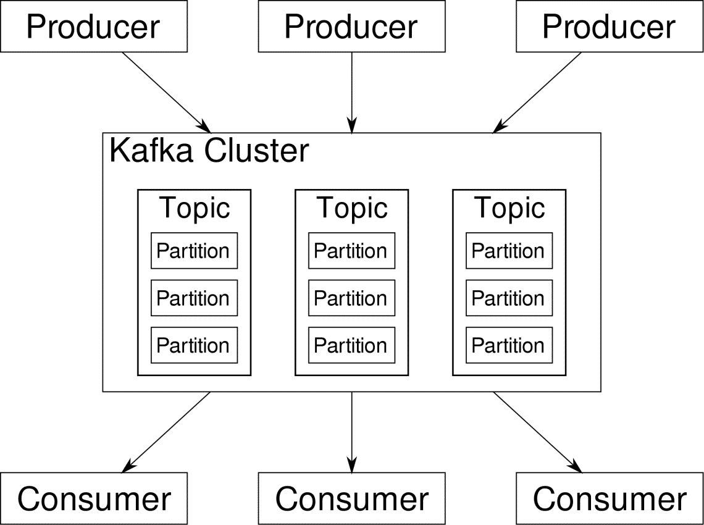
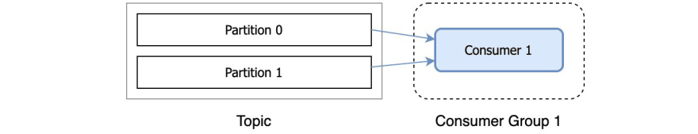
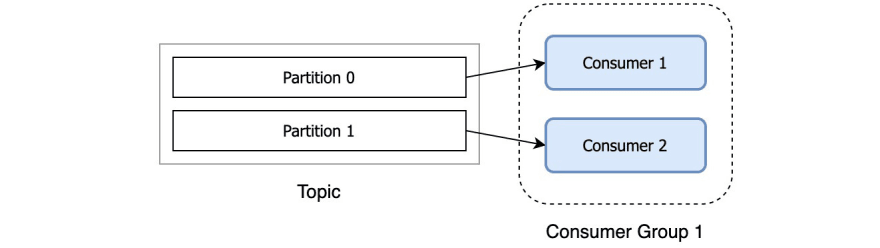
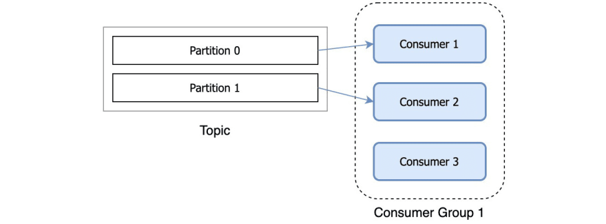
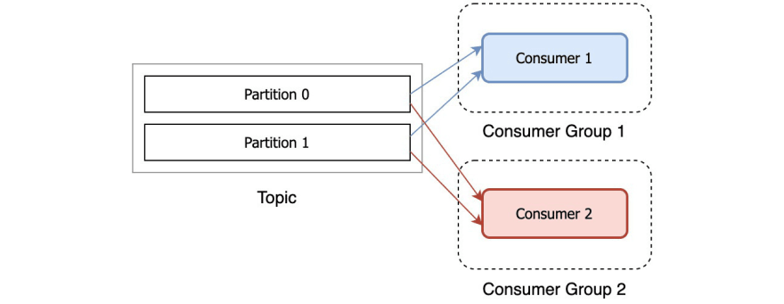
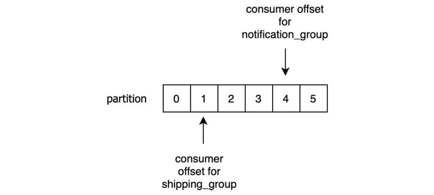

# Definitions


Apache Kafka is a data streaming platform responsible for streaming 
data from a number of sources to a lot of targets. The sources are
also called producers. The data produced is needed by a completely 
different group called consumers for various purposes. Kafka is
the layer that sits between the producers and consumers and aggregates 
the data into a usable pipeline. Also Kafka itself is a distributed 
platform, so the Kafka layer is composed of various servers running a kafka, 
these servers or nodes are hence known as Kafka Brokers.



### Topics
Kafka Topics are like tables of a database. Each topic consists 
of data from a particular source of a particular type. For example, 
your cluster’s health can be a topic consisting of CPU and memory utilization 
information. Similarly, incoming traffic to across the cluster can be another topic.

### Partition
Kafka is designed to be horizontally scalable. That is to say, a single 
instance of Kafka consists of multiple Kafka brokers running across 
multiple nodes, each can handle streams of data parallel to the other. Even 
if a few of the nodes fail your data pipeline can continue to function. 
A particular topic can then be split into a number of partitions. This 
partitioning is one of the crucial factors behind the horizontal scalability 
of Kafka.

Data from a producer are sent to partitions randomly

### Producer
Multiple producers, data sources for a given topic, can write to that topic 
simultaneously because each writes to a different partition, at any 
given point. Data is assigned to a partition depending on a key passed with 
message, unless we provide it with a key.

### Replication Factor
Kafka replicates the log for each topic's partitions across a configurable 
number of servers (you can set this replication factor on a topic-by-topic basis). 
This allows automatic failover to these replicas when a server in the cluster 
fails so messages remain available in the presence of failures.  

### Consumer Group 
When a topic is consumed by consumers in the same group, every record will be
delivered to only one consumer. As the official documentation states: “If all 
the consumer instances have the same consumer group, then the records will effectively 
be load-balanced over the consumer instances.”

Each topic consists of one or more partitions. When a new consumer is started 
it will join a consumer group (this happens under the hood) and Kafka will 
then ensure that each partition is consumed by only one consumer from that group.

So, if you have a topic with two partitions and only one consumer in a group, 
that consumer would consume records from both partitions.

After another consumer joins the same group, each consumer would continue 
consuming only one partition.

If you have more consumers in a group than you have partitions, extra consumers 
will sit idle, since all the partitions are taken. If you know that you will need 
many consumers to parallelize the processing, then plan accordingly with the number 
of partitions.

You can have many consumers reading the same records from the topic, as long as 
they all have different group ids.


### Kafka Streams
Kafka Streams is a Java API that allows to place data from topic to topic
and transform the data at the same time.

### KSQL
KSQL is Addon to Kafka Streams that allows to use SQL like language instead of Java API
to generate Kafka Streams applications.


### Get Kafka
Download kafka from 
https://apache-mirror.rbc.ru/pub/apache/kafka/2.7.0/kafka_2.13-2.7.0.tgz

Kafka works on top of zookeeper. ZK must be started first, 
and then run Kafka on top of it.
Kafka is using Apache Zookeeper to manage its cluster metadata, 
so we need a running Zookeeper cluster.

Start zk first
```shell
$ bin/zookeeper-server-start.sh config/zookeeper.properties
```
This will start a Zookeeper service listening on port 2181. After this, 
we can use another script to run the Kafka server:
```shell
$ bin/kafka-server-start.sh config/server.properties
```

After a while, a Kafka broker will start. Let's add a few topics to this simple cluster:
```shell
$ bin/kafka-topics.sh --create --topic users.registrations --replication-factor 1 \
  --partitions 2  --zookeeper localhost:2181
$ bin/kafka-topics.sh --create --topic users.verfications --replication-factor 1 \
  --partitions 2  --zookeeper localhost:2181
```

To list all Kafka topics in a cluster, we can use the bin/kafka-topics.sh 
shell script bundled in the downloaded Kafka distribution. All we have 
to do is to pass the –list option along with the information about the cluster. 
For instance, we can pass the Zookeeper service address:
```shell
$ bin/kafka-topics.sh --list --zookeeper localhost:2181
users.registrations
users.verfications
```

**In order to talk to the Kafka cluster, we need 
to pass the Zookeeper service URL using the ``-–zookeeper`` option.**


Once we've found a list of topics, we can take a peek at the details 
of one specific topic. To do that, we can use the ``–describe –topic <topic name>`` 
combination of options:
```shell
$ bin/kafka-topics.sh --bootstrap-server=localhost:9092 --describe --topic topic

Topic: users.registrations      PartitionCount: 2       ReplicationFactor: 1    Configs: segment.bytes=1073741824
        Topic: users.registrations      Partition: 0    Leader: 0       Replicas: 0     Isr: 0
        Topic: users.registrations      Partition: 1    Leader: 0       Replicas: 0     Isr: 0
```

Watch for messages by partition:
```shell
$ bin/kafka-console-consumer.sh --bootstrap-server localhost:9092 --topic topic --partition 5  --offset 0
```

See all topic stats:
```shell
$ bin/kafka-consumer-groups.sh --bootstrap-server localhost:9092 --group testGroup --describe
```

### A consumer group and record offset
Each record is uniquely identified by an offset in the partition. 
These offsets are used to track which record has been consumed by which consumer group.

Kafka employs an approach of ‘a dumb pipeline, smart clients’ meaning that Kafka 
brokers don’t know anything about consumer offsets. The consumers themselves are in 
charge of tracking which records have been consumed. Once the consumer reads the 
record it will store this offset in a special Kafka topic called __consumer_offsets 
(yes, those are two underscores at the beginning). When a consumer stores the offset 
in this topic we’re saying that it’s committing the offset.

This enables consumers to always know which record should be consumed next from a 
given partition. Since the consumer offset is stored in Kafka, it means that the 
position of the consumer group is maintained even after restarts.

The records remain in the topic even after being consumed. This allows multiple 
consumers to consume the same message, but it also allows one more thing: the 
same consumer can re-consume the records it already read, by simply rewinding 
its consumer offset. This is very useful when you e.g. had a bug in your consumer
and want to re-read the records after fixing the bug.


https://www.youtube.com/watch?v=6UDwdUAqCOE
1:01:05